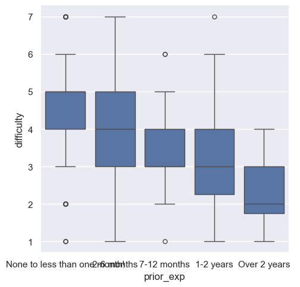
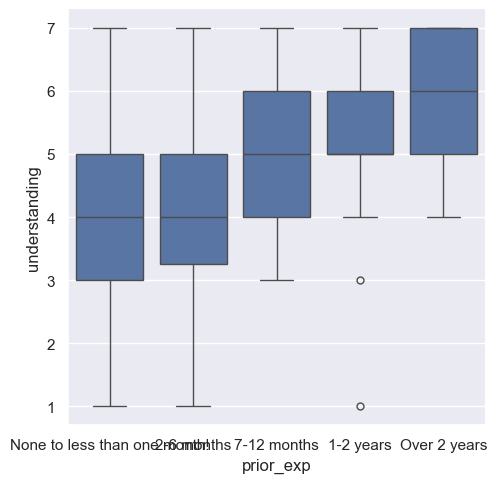
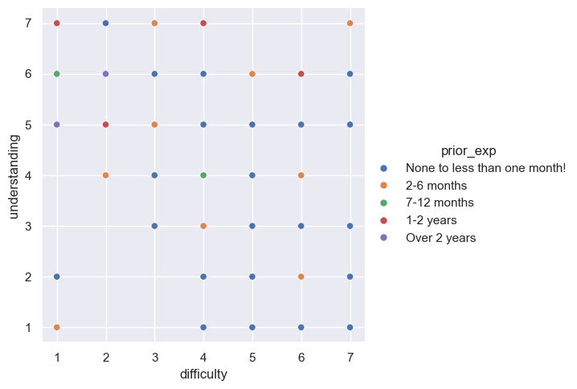

---
# Do not edit the text between these lines!
layout: default
---

# COMP110 Data Analysis Project

<!-- This is a comment. Below, you'll see code for inserting an image. To make this image appear, update <custom-path>. To add an image, save it inside the imgs folder of this repository. -->

## About Me
Hi, I am Philip Roh, an exchange student attending UNC Chapel Hill. 
I am interested in data analysis and exploring how data can be used to improve learning experiences.

---

## Introduction

This analysis explores how prior programming experience influences students’ perceptions of course difficulty and their level of understanding in COMP110. The goal is to identify whether differences in background create gaps in experience, and to consider potential improvements that could better support all students.

---

## Analysis

### 1. Prior Experience vs. Perceived Difficulty

The first step is to examine how prior programming experience relates to how difficult students perceive the course to be.

<!-- INSERT GRAPH 1 HERE -->

<!-- Example: seaborn histogram or boxplot of difficulty grouped by experience -->

The visualization shows that students with more prior programming experience generally report lower levels of perceived difficulty. In contrast, students with little or no experience tend to report higher difficulty.

---

### 2. Prior Experience vs. Understanding

Next, we analyze how prior experience impacts students’ reported level of understanding.

<!-- INSERT GRAPH 2 HERE -->

<!-- Example: seaborn boxplot or bar chart of understanding grouped by experience -->

This pattern is consistent: students with more experience tend to report higher levels of understanding. This reinforces the idea that prior exposure plays an important role in shaping how students engage with the course material.

---

### 3. Variability Within Groups

Although clear trends exist, it is important to examine whether these relationships are consistent across all students.

<!-- INSERT GRAPH 3 HERE -->

The data reveals noticeable variability within each experience group. Some students with little experience still report high understanding, while some experienced students report moderate difficulty. This suggests that prior experience is not the only factor influencing outcomes.

---

## Conclusion

The analysis suggests that students with more prior programming experience tend to perceive the course as less difficult and report higher levels of understanding. This trend appears consistently across multiple visualizations, indicating a clear relationship between prior experience and student perception.

However, this relationship is not strictly linear. There is still variability within each experience group, showing that other factors also influence student success.

Based on these findings, it may be valuable to introduce additional beginner-friendly support, such as optional foundational resources or supplementary practice materials. These could help reduce perceived difficulty and improve understanding for students with less experience.

At the same time, there are important trade-offs to consider. Adding too much introductory content could slow the pace for more experienced students. Therefore, a balanced approach—such as offering optional resources rather than modifying the core structure—would likely create the most value.

Overall, the data supports the idea that flexible support systems could improve accessibility while maintaining course rigor. Future improvements could explore more targeted strategies to support students with diverse backgrounds.